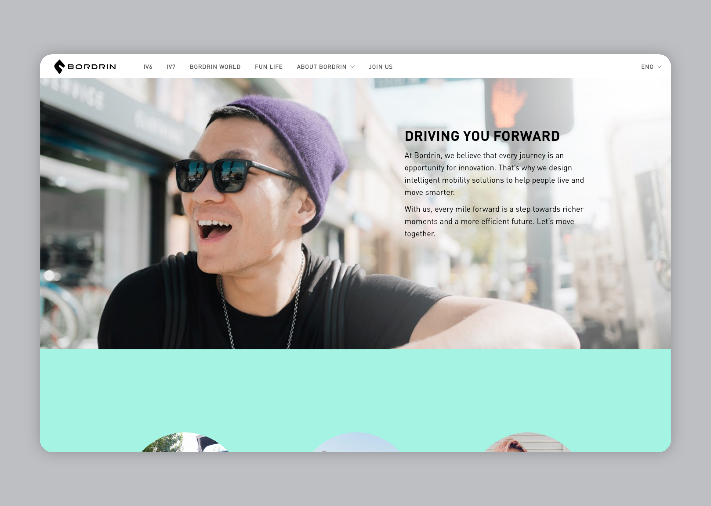
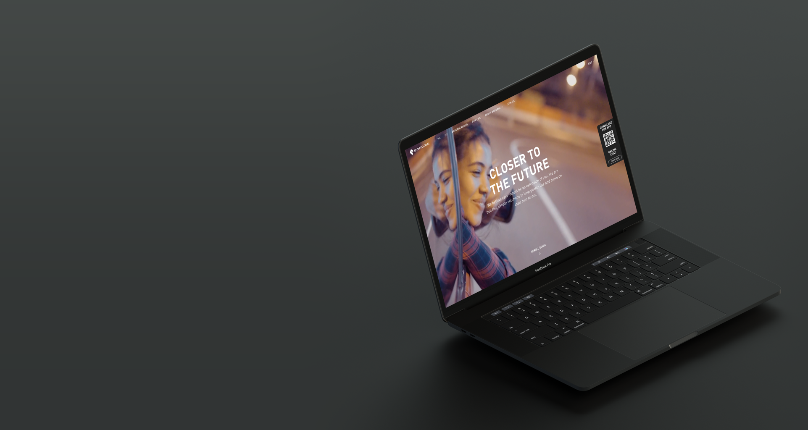
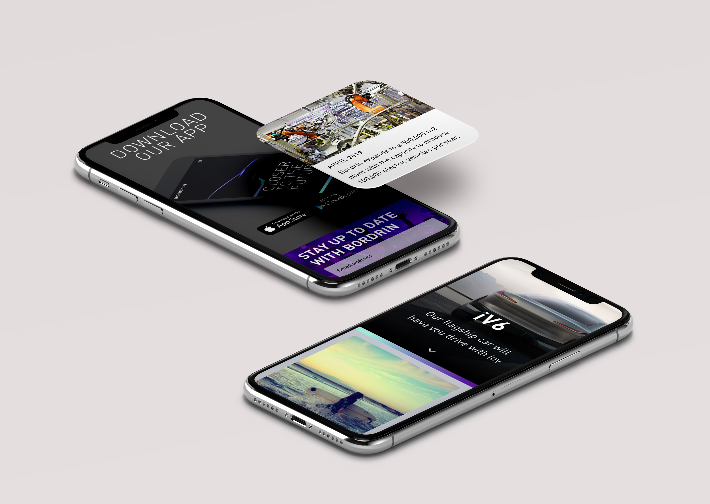
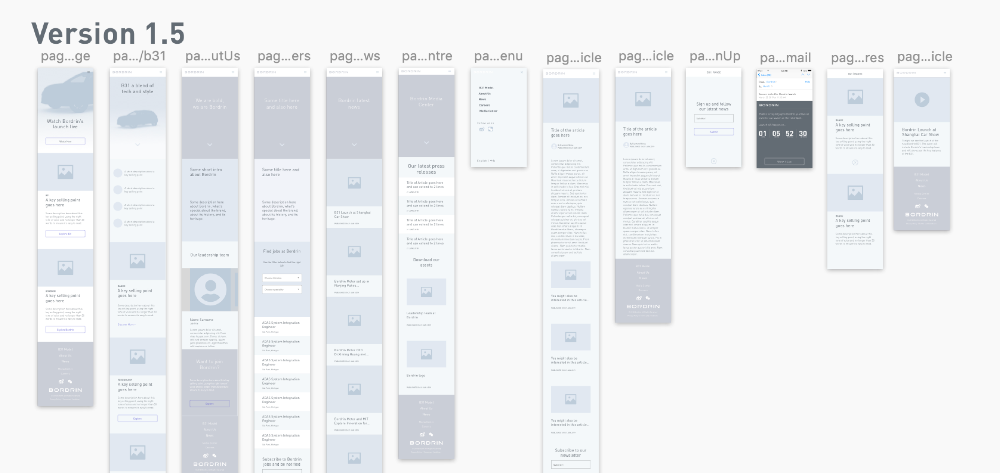
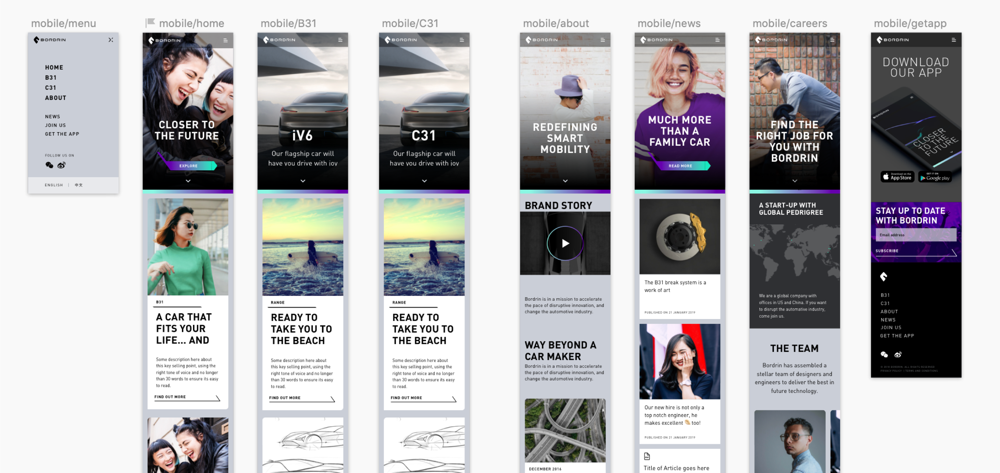

## Reliable, forward-thinking... and fun
Bordrin is a newcomer in the (EV) car brand landscape in China, which is fast becoming a crowded market place and a world leader. Yet, the company has great ambition and shows incredible engineering prowess (especially in electric battery lifetime) that will ensure its success. It was up to Fitch to create a standout brand that conveyed both reliability, forward-thinking... and above all fun.

As Bordrin is a new company, the website's main aims are to:

- CONVEY THE BRAND AND ITS REACH
- SHOWCASE THE CARS
- SHOWCASE THE CARS' TECHNOLOGY

We designed a website structure that lays out the proposition clearly, and holds no punches as to Bordrin's ambition. The home page shows the brand in its full glory and features links to the cars and the other secondary pages.

We then proposed two rich pages for both flagship cars, a brand focused page, a blog and a careers page. Pretty simple really, but it's all the site needs. We took great care to make it as concise as possible.

