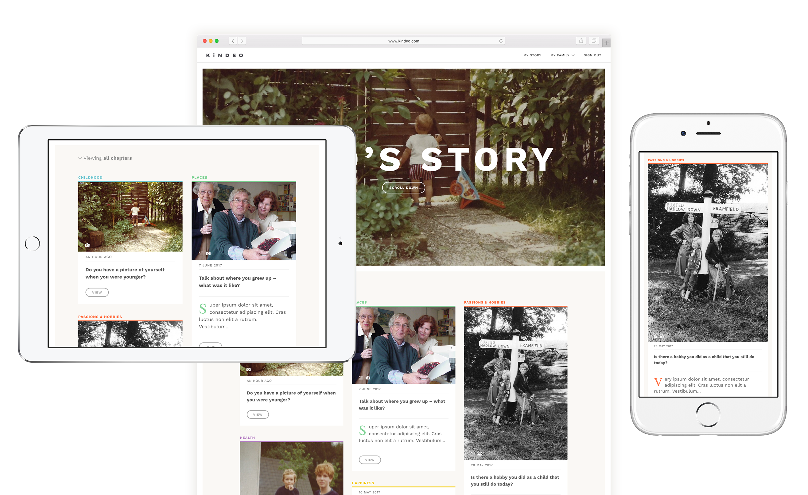

Working with the team at Kindeo I first audited the user journeys, identifying the bottlenecks. The resulting redesigned UI made it much clearer for users to navigate around the site. At the same time I worked on creating new features like text input, photo capture and library upload, and we added a private web based dashboard where users can view each other's stories.

